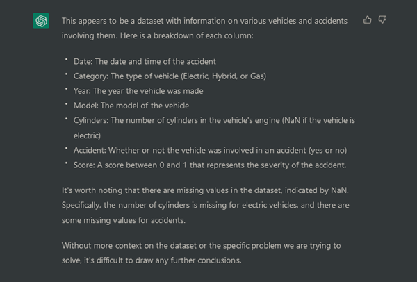
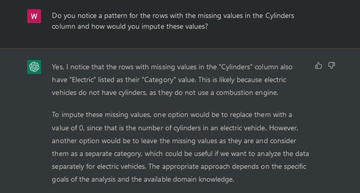

ChatGPT took the world by storm and reached over a [100 Million unique users](https://www.reuters.com/technology/chatgpt-sets-record-fastest-growing-user-base-analyst-note-2023-02-01/) since its release, 
which makes it the fastest application ever to hit this milestone and everyone is talking about it. 
If even your non-tech-savvy grandpa asks if you heard of a new, disrupting AI, the chances are that such a technology is overhyped. 
But in this case I‘m not sure if it is overhyped or if it will significantly alter how we search, work and entertain ourselves.

As a data scientist searching for code snippets to improve productivity is part of the job. 
But for more complicated or very specific tasks a google search is not enough and you have to describe your problem to others. 
StackOverflow is exactly filling that void by providing a public platform. 
The disadvantage is that somebody with the appropriate knowledge has to take the time to read your question and answer, 
hopefully in a timely manner. Additionally, you might not want to publish your exact data or problem to a public forum.

ChatGPT could solve these limitations if it is able to answer correctly. 

### Data Generation and Inspection

At the beginning of every new project a data scientist has to become acquainted with the data and bring it to a workable form. 
This can be time consuming and theoretically an AI could much faster scan through the data to find anomalies and propose the suitable preprocessing steps.
So let’s generate some data and test ChatGPT.

def create_dataset(size):
    """Creating a dataset of Cars"""
    df=pd.DataFrame()
    #creating a Date column with random timestamps using Unix timestamp (1676851200== '2023-02-20 00:00:00')
    # from that timestamp up to 1 year in increments of 1 hour and then converting the timestamp to a string
    df['Date'] = np.random.randint(0, 24*365, size)*60*60 + 1676851200
    df['Date'] = pd.to_datetime(df['Date'], unit='s').dt.strftime('%Y-%m-%d %X')
    
    df['Category'] = np.random.choice(['Gas','Hybrid','Electric'], size)
    df['Year'] = np.random.randint(2010, 2024, size)
    df['Model'] = np.char.add(np.random.choice(['BMW','VW', 'Mercedes'], size) , ['-' + str(i) for i in np.random.randint(1, 1000, size)])
    df['Cylinders'] = np.random.randint(2, 17, size)
    df['Accident'] = np.random.choice(['yes','no'], size)
    df['Score'] = np.random.uniform(1, 0, size)
  
    # Electric cars dont have cylinders and cylinders is set to NaN
    df.loc[df['Category']=='Electric','Cylinders']=np.nan
    return df



I told ChatGPT to act as a data scientist, gave it 15 generated rows and asked to show the data as a table and what it can tell me about the data.

|    | Date                | Category | Year | Model         | Cylinders | Accident | Score    |
|---:|:--------------------|:---------|-----:|:--------------|----------:|:---------|:---------|
|  0 | 2024-01-23 10:00:00 | Electric | 2023 | Mercedes-649  | nan       | yes      | 0.841197 |
|  1 | 2023-09-03 17:00:00 | Hybrid   | 2022 | BMW-643       |        16 | yes      | 0.328648 |
|  2 | 2023-06-16 15:00:00 | Gas      | 2015 | Mercedes-576  |         3 | yes      | 0.976297 |
|  3 | 2023-05-26 17:00:00 | Hybrid   | 2016 | VW-286        |         3 | yes      | 0.93958  |
|  4 | 2024-01-28 03:00:00 | Hybrid   | 2021 | VW-16         |        10 | no       | 0.422429 |
|  5 | 2023-05-16 06:00:00 | Hybrid   | 2022 | VW-236        |         8 | yes      | 0.600904 |
|  6 | 2023-03-29 17:00:00 | Gas      | 2022 | Mercedes-661  |        10 | no       | 0.195019 |
|  7 | 2023-08-21 03:00:00 | Hybrid   | 2020 | VW-260        |         4 | yes      | 0.617065 |
|  8 | 2023-07-20 01:00:00 | Hybrid   | 2023 | BMW-741       |         6 | yes      | 0.660679 |
|  9 | 2023-07-18 03:00:00 | Gas      | 2017 | VW-406        |        10 | no       | 0.197118 |
| 10 | 2023-05-30 11:00:00 | Electric | 2023 | VW-245        | nan       | yes      | 0.046335 |
| 11 | 2024-02-12 07:00:00 | Electric | 2012 | BMW-703       | nan       | yes      | 0.310187 |
| 12 | 2023-04-01 19:00:00 | Electric | 2012 | BMW-514       | nan       | no       | 0.744327 |
| 13 | 2023-03-08 04:00:00 | Electric | 2013 | BMW-923       | nan       | no       | 0.042386 |
| 14 | 2024-01-18 09:00:00 | Gas      | 2023 | VW-519        |         6 | yes      | 0.292849 |

So far so good, ChatGPT correctly allocated each field of the data to the correct cell, even though the data is only separated by spaces. Interestingly, it outputs the Cylinders-column as integers although the inputs were floats.
The description is impressive, as I did not give ChatGPT any additional information and it correctly recognized that the data is of vehicles and also that the values in the Cylinders column are missing for electric cars. 

In contrast, it is alarming that in spite of complete data for the Accident column it claims missing values. 

### Missing Data

The next step would be to handle the missing data:

